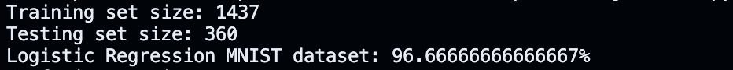
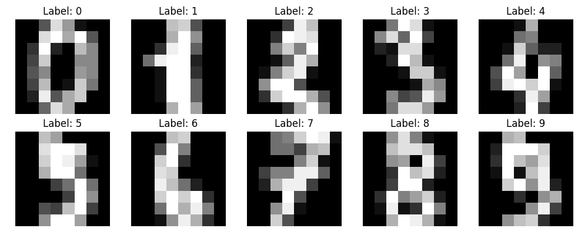
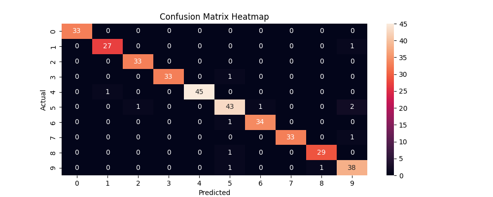
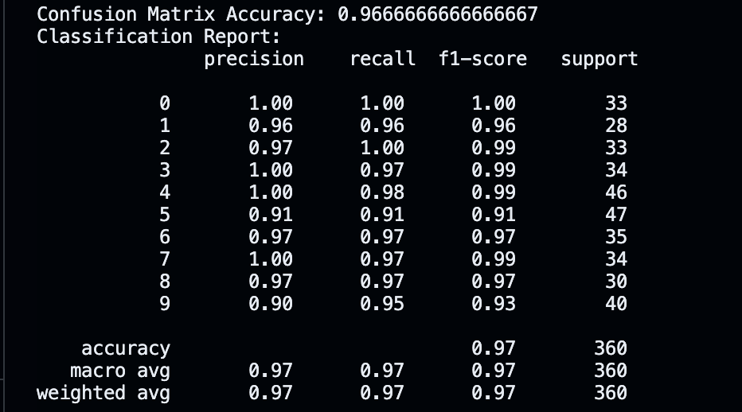

# Comp-472-Project-1

## Project Description
This project is a Machine Learning application that classifies handwritten digits (0-9) using the **digits dataset** from **scikit-learn**. We want to build a digit recognizer using **Logistic Regression**.

We focus on:
- Loading and exploring the dataset 
- Training a Logistic Regression Model
- Evaluating the model performance using metrics like accuracy, precision, recall, and confusion matrix.

## Project Structure
```
Comp-472-Project-1/
|---- images/
      |--- classification_report.png
      |--- confusion_matrix.png
      |--- nbr_dataset.png
      |--- sample_input.png
|---- mnist_classifier.py
|---- README.md
|---- requirements.txt
```

## Setup Instruction
1. Clone the repository
2. Create and activate a virtual environment using venv
   ```bash
   python3 -m venv venv
   source venv/bin/activate 
4. Install the dependencies  
   ```bash
   pip install -r requirements.txt
5. How to run the project
    ```bash
    python3 mnist_classifier.py
    
## Dataset Used
We use the **digits** dataset from **scikit-learn**:
- 1797 grayscale images
- 8x8 pixels each (flattened to 64 features)
- Labels from 0 to 9

## Libraries Used
- NumPy
- MatPlotLib
- Sci-kit learn
- Seaborn

## Model Evaluation
Generate a **confusion matrix** to see how well each digit is classified.
Generate a **classification report** for precision, recall, and F1-score.
Display the confusion matrix and classification report using **print()**.

We also included additional steps such as:
1. Visualizing the confusion matrix using a heatmap for improved readability.
2. Calculating the model's accuracy directly from the confusion matrix.

## Sample Results

### Number of training dataset and testing dataset:
Below is the number of data for training and testing:
<p align="center">
  
</p>

### Input Image Examples
Here is a sample of handwritten digits from the dataset:

<p align="center">
  
</p>

### Confusion Matrix
Below is the confusion matrix heatmap:
<p align="center">
  
</p>

### Classification Report
Here is our classification report: 
<p align="center">
  
</p>


